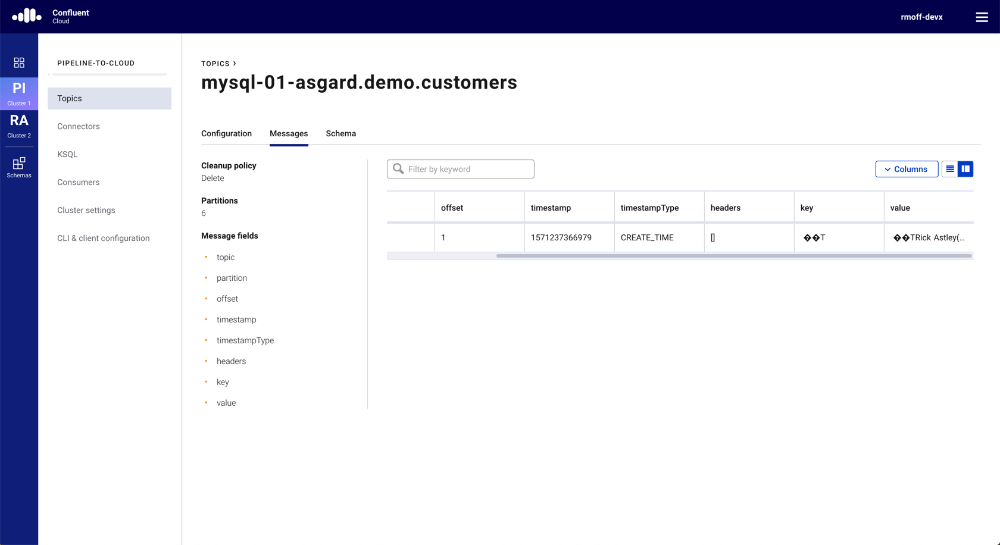

= Using Debezium with Confluent Cloud
Robin Moffatt <robin@confluent.io>
v0.01, 16 October 2019
                 
This is based on using https://confluent.cloud[Confluent Cloud] to provide your managed Kafka and Schema Registry. All that you run yourself is the Kafka Connect worker. 

=== What you need

A https://confluent.cloud[Confluent Cloud] account with a Kafka and Schema Registry API host names and keys. Write these to a `.env` file: 

[source,bash]
----
CCLOUD_BROKER_HOST=
CCLOUD_API_KEY=
CCLOUD_API_SECRET=
CCLOUD_SCHEMA_REGISTRY_URL=
CCLOUD_SCHEMA_REGISTRY_API_KEY=
CCLOUD_SCHEMA_REGISTRY_API_SECRET=
----

=== Install Debezium connector

This article assumes that you're running your own Kafka Connect worker with the https://docs.confluent.io/current/cloud/connect/connect-cloud-config.html[appropriate configuration] done to hook it up to Confluent Cloud's brokers and Schema Registry.

You need to install the Debezium connector on the Kafka Connect worker: 

[source,bash]
----
confluent-hub install --no-prompt debezium/debezium-connector-mysql:0.10.0
----

You can also do this as part of your Docker Compose: 

[source,bash]
----
    command: 
      - bash 
      - -c 
      - |
        echo "Installing connector plugins"
        confluent-hub install --no-prompt debezium/debezium-connector-mysql:0.10.0
        #
        echo "Launching Kafka Connect worker"
        /etc/confluent/docker/run & 
        #
        sleep infinity
----

=== Pre-create the topics to which you'll be writing

* Make sure your `ccloud` environment is using the correct Confluent Cloud cluster
+
[source,bash]
----
$ ccloud kafka cluster list
      Id      |       Name        | Provider |  Region   | Durability | Status
+-------------+-------------------+----------+-----------+------------+--------+
    lkc-42p8m | pipeline-to-cloud | aws      | us-east-1 | HIGH       | UP
  * lkc-43xgj | race-mapper       | aws      | us-east-1 | LOW        | UP

$ ccloud kafka cluster use lkc-42p8m
----

* Create the topics - one for the DDL, plus one per source table. 
+
The topic name is defined by : 
+
** an optional Single Message Transform used in the example which prepends a `mysql-01-` prefix
** the `database.server.name` (`asgard`)
** the database name (`demo`) plus table name
+
[source,bash]
----
# Schema DDL goes in this topic
ccloud kafka topic create mysql-01-asgard
# Table-specific topics: 
ccloud kafka topic create mysql-01-asgard.demo.customers
ccloud kafka topic create mysql-01-asgard.demo.transactions
----
+
If you don't do this, you'll get repeating errors in your Kafka Connect worker log:
+
[source,bash]
----
Error while fetching metadata with correlation id … : {<…topic…>=UNKNOWN_TOPIC_OR_PARTITION} 
----
+
You can create the topics afterwards if you forget, but it's easier up-front

=== Create the connector

Now create the connector itself, substituting your MySQL details below as indicated. The Confluent Cloud details and credentials will be picked up from the file `/data/credentials.properties` which if you're using Docker can be mapped from the same `.env` file as above. Or, just hardcode the values if you'd prefer 🤷‍.

The configuration is the same as a normal Debezium connector except the additional details for the connector to be able to connect to Confluent Cloud for writing and reading the https://debezium.io/documentation/reference/0.10/connectors/mysql.html#database-schema-history[database schema history topic].

[source,bash]
----
curl -i -X PUT -H  "Content-Type:application/json" \
    http://localhost:8083/connectors/source-debezium-mysql-02/config \
    -d '{
    "connector.class": "io.debezium.connector.mysql.MySqlConnector",
    "database.hostname": "mysql",
    "database.port": "3306",
    "database.user": "debezium",
    "database.password": "dbz",
    "database.server.name": "asgard",
    "database.history.kafka.bootstrap.servers": "${file:/data/credentials.properties:CCLOUD_BROKER_HOST}",
    "database.history.kafka.topic": "dbz_dbhistory.asgard-01",
    "database.history.consumer.security.protocol": "SASL_SSL",
    "database.history.consumer.ssl.endpoint.identification.algorithm": "https",
    "database.history.consumer.sasl.mechanism": "PLAIN",
    "database.history.consumer.sasl.jaas.config": "org.apache.kafka.common.security.plain.PlainLoginModule required username=\"${file:/data/credentials.properties:CCLOUD_API_KEY}\" password=\"${file:/data/credentials.properties:CCLOUD_API_SECRET}\";",
    "database.history.producer.security.protocol": "SASL_SSL",
    "database.history.producer.ssl.endpoint.identification.algorithm": "https",
    "database.history.producer.sasl.mechanism": "PLAIN",
    "database.history.producer.sasl.jaas.config": "org.apache.kafka.common.security.plain.PlainLoginModule required username=\"${file:/data/credentials.properties:CCLOUD_API_KEY}\" password=\"${file:/data/credentials.properties:CCLOUD_API_SECRET}\";",
    "table.whitelist":"demo.transactions,demo.customers",
    "decimal.handling.mode":"double",
    "transforms": "unwrap,addTopicPrefix",
    "transforms.unwrap.type": "io.debezium.transforms.ExtractNewRecordState",
    "transforms.addTopicPrefix.type":"org.apache.kafka.connect.transforms.RegexRouter",
    "transforms.addTopicPrefix.regex":"(.*)",
    "transforms.addTopicPrefix.replacement":"mysql-01-$1"
    }'
----

Check that the connector is running: 

[source,bash]
----
$ curl -s "http://localhost:8083/connectors?expand=info&expand=status" | jq '. | to_entries[] | [ .value.info.type, .key, .value.status.connector.state,.value.status.tasks[].state,.value.info.config."connector.class"]|join(":|:")' | column -s : -t| sed 's/\"//g'| sort

source  |  source-debezium-mysql-02  |  RUNNING  |  RUNNING  |  io.debezium.connector.mysql.MySqlConnector
----

=== Consume the data

[source,bash]
----
source .env

docker run --rm edenhill/kafkacat:1.5.0 \
      -X security.protocol=SASL_SSL -X sasl.mechanisms=PLAIN \
      -X ssl.ca.location=./etc/ssl/cert.pem -X api.version.request=true \
      -b ${CCLOUD_BROKER_HOST} \
      -X sasl.username="${CCLOUD_API_KEY}" \
      -X sasl.password="${CCLOUD_API_SECRET}" \
      -r https://"${CCLOUD_SCHEMA_REGISTRY_API_KEY}":"${CCLOUD_SCHEMA_REGISTRY_API_SECRET}"@${CCLOUD_SCHEMA_REGISTRY_URL} \
      -s avro \
      -t mysql-01-asgard.demo.transactions \
      -C -o -5 
{"txn_id": {"int": 996}, "customer_id": {"int": 4}, "amount": {"double": 69.819999999999993}, "currency": {"string": "CNY"}, "txn_timestamp": {"string": "2018-04-10T10:23:41Z"}}
{"txn_id": {"int": 997}, "customer_id": {"int": 1}, "amount": {"double": 74.170000000000002}, "currency": {"string": "PEN"}, "txn_timestamp": {"string": "2018-11-19T15:29:14Z"}}
{"txn_id": {"int": 998}, "customer_id": {"int": 2}, "amount": {"double": -92.920000000000002}, "currency": {"string": "JPY"}, "txn_timestamp": {"string": "2018-05-25T19:43:48Z"}}
{"txn_id": {"int": 999}, "customer_id": {"int": 1}, "amount": {"double": 71.159999999999997}, "currency": {"string": "EUR"}, "txn_timestamp": {"string": "2018-11-15T07:24:44Z"}}
{"txn_id": {"int": 1000}, "customer_id": {"int": 5}, "amount": {"double": 28.149999999999999}, "currency": {"string": "IRR"}, "txn_timestamp": {"string": "2018-01-12T14:53:49Z"}}
{"txn_id": {"int": 603}, "customer_id": {"int": 4}, "amount": {"double": -85.510000000000005}, "currency": {"string": "CNY"}, "txn_timestamp": {"string": "2018-11-08T22:06:49Z"}}
----
